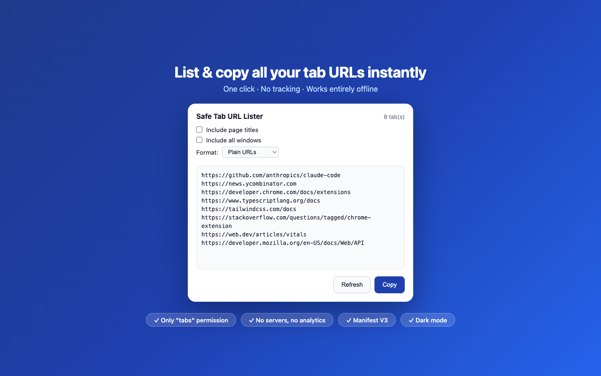
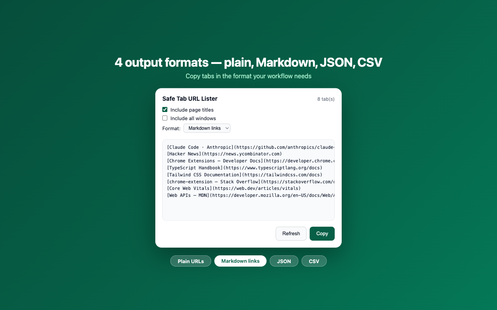
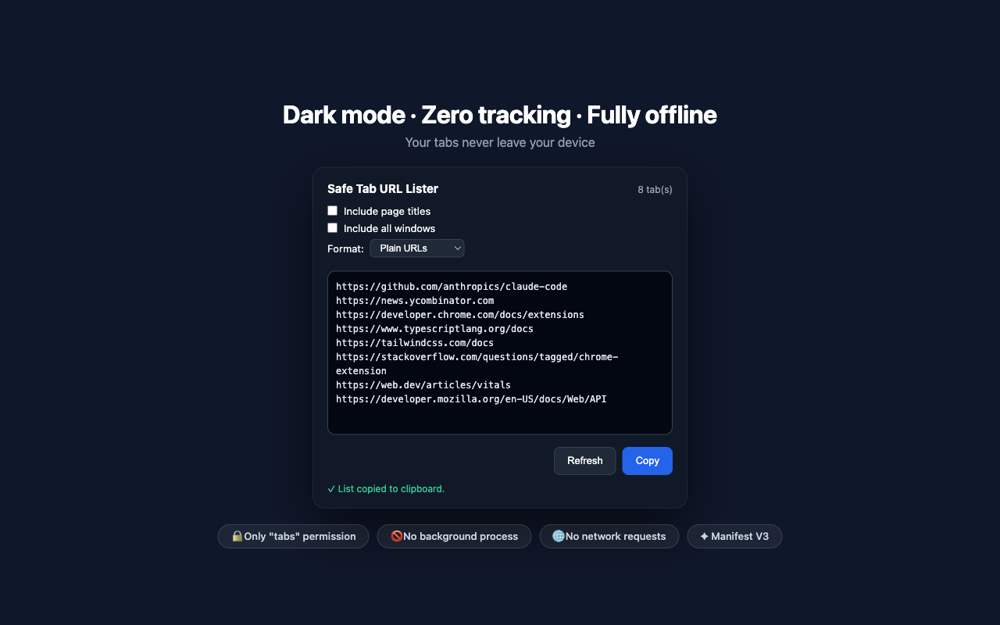

# Safe Tab URL Lister

[](LICENSE)
[](https://developer.chrome.com/docs/extensions/mv3/intro/)
[](https://chrome.google.com/webstore/detail/lfoiekncpjoomigglgjildmjodpfmoif)
[](_locales/)

A minimal, privacy-first Chrome extension that instantly lists and copies all open tab URLs — no servers, no tracking, everything stays on your device.

---

## Screenshots

| Plain URLs | Markdown Links | Dark Mode |
|:---:|:---:|:---:|
|  |  |  |

---

## Features

- **List URLs** from the current window or all open Chrome windows
- **Include page titles** alongside each URL (optional)
- **4 output formats:**
  - Plain URLs — one per line
  - Markdown links — `[Page Title](https://url)`
  - JSON — structured array for developers
  - CSV — spreadsheet-ready with optional titles
- **One-click copy** to clipboard
- **Dark mode** support (follows system preference)
- **Keyboard accessible** (WCAG 2.1 AA)
- **Bilingual** — English and Turkish

---

## Privacy

This extension is designed with a minimal-permission, zero-data-collection approach:

| What | Status |
|------|--------|
| Permissions | Only `tabs` — nothing else |
| `host_permissions` | None |
| Background service worker | None |
| Network requests | None |
| Data collection / analytics | None |
| Cookies / storage | None |
| External dependencies | None |

**Your browsing data never leaves your device.**

---

## Installation

### From Chrome Web Store

[Install from the Chrome Web Store](https://chrome.google.com/webstore/detail/lfoiekncpjoomigglgjildmjodpfmoif) *(pending review)*

### Load Unpacked (Developer Mode)

1. Clone or download this repository
2. Open `chrome://extensions/`
3. Enable **Developer mode** (top-right toggle)
4. Click **Load unpacked** → select this folder

---

## Output Format Examples

**Plain:**
```
https://github.com
https://example.com
```

**Markdown (with titles):**
```markdown
[GitHub](https://github.com)
[Example Domain](https://example.com)
```

**JSON:**
```json
[
  { "title": "GitHub", "url": "https://github.com" },
  { "title": "Example Domain", "url": "https://example.com" }
]
```

**CSV:**
```csv
title,url
"GitHub","https://github.com"
"Example Domain","https://example.com"
```

---

## Development

See [CONTRIBUTING.md](CONTRIBUTING.md) for setup instructions, code style guidelines, and how to build the store zip.

**Regenerate icons:**
```bash
node generate-icons.js
```

---

## Changelog

See [CHANGELOG.md](CHANGELOG.md).

---

## License

[MIT](LICENSE) © 2026 Mümin Köykıran
