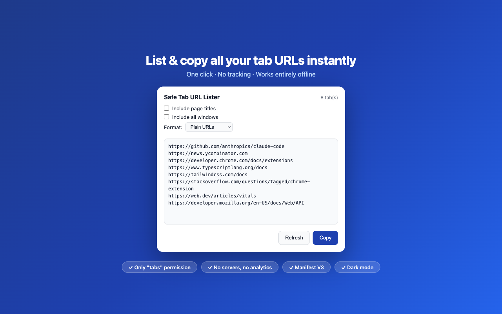
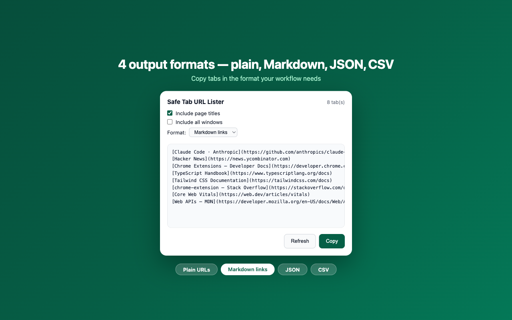
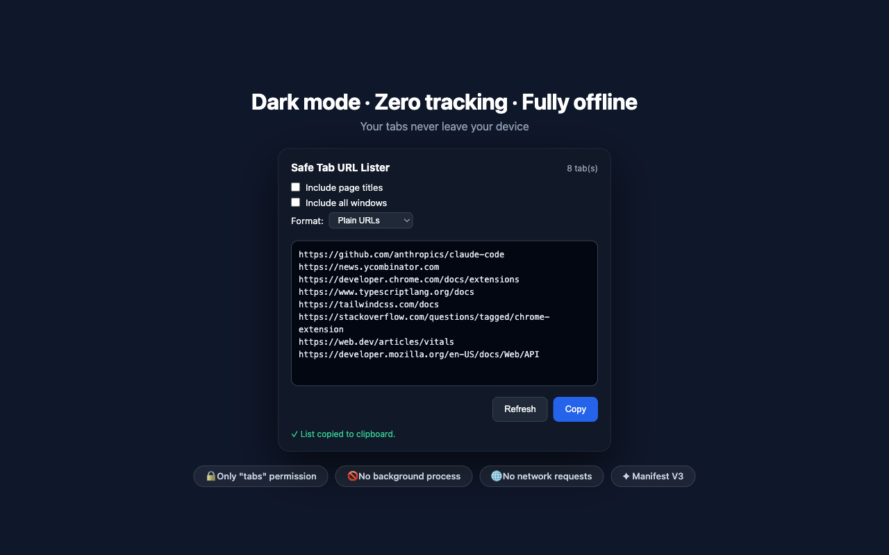

# Safe Tab URL Lister — Copy All Chrome Tab URLs Instantly

[](LICENSE)
[](https://developer.chrome.com/docs/extensions/mv3/intro/)
[](https://chrome.google.com/webstore/detail/lfoiekncpjoomigglgjildmjodpfmoif)
[](_locales/)

A free, open-source Chrome, Firefox and Safari extension that collects every URL from your open tabs and copies them in the format you need — plain text, Markdown links, a JSON array, CSV or TSV. No servers, no tracking, no accounts. Everything runs locally in your browser.

---

## The Problem This Solves

When you have 20, 50, or 100 tabs open and need to save, share, or process those URLs, browsers give you no built-in way to extract them as text. Bookmarking all tabs is permanent and clutters your bookmark bar. Taking a screenshot loses the clickable URLs. Manually copying each address is slow and error-prone.

Safe Tab URL Lister solves this in one click. Click the icon, choose your format (plain text, Markdown, JSON, CSV or TSV), and copy. Your URLs are on the clipboard, ready to paste into a document, a spreadsheet, a code editor, or an AI chat window.

---

## Quick Facts

| Property | Value |
|---|---|
| Output formats | Plain URLs, Markdown links, JSON array, CSV, TSV |
| Permissions required | `tabs` and `tabGroups` only |
| Network requests | Zero |
| Data collection | None |
| Price | Free |
| Source | Open source (MIT) |
| Minimum Chrome version | 88 |
| Languages | English, Turkish |
| Accessibility | WCAG 2.1 AA |

---

## Screenshots

| Plain URLs | Markdown Links | Dark Mode |
|:---:|:---:|:---:|
|  |  |  |

---

## Features

- **List URLs** from the current window or all open Chrome windows
- **Include page titles** alongside each URL (optional)
- **5 output formats:**
  - Plain URLs — one per line
  - Markdown 
    - Single Line: `[Page Title](https://url)`
    - Markdown w/ Links:
      ```markdown
 [Page Title](https://url)
  * field name: field value
      ```
  - JSON — structured array for developers
  - CSV — spreadsheet-ready with optional titles
  - TSV - Tab seperated values
- **One-click copy** to clipboard
- **Dark mode** support (follows system preference)
- **Keyboard accessible** (WCAG 2.1 AA)
- **Bilingual** — English and Turkish
- **Safari Limitations** The Safari browser does not support providing the *Last Accessed* or *Tab Group* information.

---

## Who Uses This

**Researchers and academics** — capture all source URLs at the end of a reading session without manually copying each address.

**Developers and engineers** — grab all open tabs as a JSON array to pipe into scripts, bug reports, or data tools.

**Writers and editors** — export tabs as Markdown links (`[Page Title](URL)`) ready to paste directly into articles, wikis, README files, or documentation.

**Students** — save all reference tabs before closing the browser so nothing is lost between study sessions.

**Data analysts** — export to CSV and open directly in Excel, Google Sheets, or LibreOffice Calc.

**AI assistant users** — paste a clean URL list into ChatGPT, Claude, Gemini, or Perplexity to let the AI summarize, categorize, or compare your open pages.

---

## Privacy

This extension is designed with a minimal-permission, zero-data-collection approach:

| What | Status |
|------|--------|
| Permissions | Only `tabs` and `tabsGroups` — nothing else |
| `host_permissions` | None |
| Background service worker | None |
| Network requests | None |
| Data collection / analytics | None |
| Cookies / storage | None |
| External dependencies | None |

**Your browsing data never leaves your device.** The extension processes everything in memory and discards it when the popup closes. Safe for use in enterprise environments and sensitive browsing sessions.

---

## Installation

For each installation type, enabling the Extension, authorizing permissions and websites, and if applicable access to Incognito / Private tabs may be required.

### Chrome ###

#### From Chrome Web Store

[Install from the Chrome Web Store](https://chrome.google.com/webstore/detail/lfoiekncpjoomigglgjildmjodpfmoif)

#### Load Unpacked (Developer Mode)

1. Clone or download this repository
2. Build: `./scripts/build.sh chrome`  or `node ./scripts/build.js chrome`
3. Open `chrome://extensions/`
4. Enable **Developer mode** (top-right toggle)
5. Click **Load unpacked** → select the ./dist/chrome folder


### Firefox ###

#### From Firefox Add On Store

Not Yet Available

#### Load Temporary Add On

1. Clone or download this repository
2. Build: `./scripts/build.sh firefox`  or `node ./scripts/build.js firefox`
3. Open `about:debugging#/runtime/this-firefox`
4. Click the **Load Temporary Addon...** button
5. Select the manifest.json file in the ./dist/firefox folder and click the **Open** button

### Safari ###

#### From Apple App Store

Not Yet Available

#### Load Temporary Extension (MacOS)

1. Clone or download this repository
2. Build: `./scripts/build.sh safari`  or `node ./scripts/build.js safari`
3. Open Safari Settings 
4. If *Developer* features not enabled, click on the **Advanced** tab and enable **Show features for web developers**
5. Click on the **Developer** tab
6. Click on the **Add Temporary Extension** button
7. Click **Select** after selecting the ./dist/safari folder

#### Via Xcode

1. Clone or download this repository
2. Build: `./scripts/build.sh safari`  or `node ./scripts/build.js safari`
3. Open the Xcode project at `./xcode/Safe\ Tab\ URL\ Lister/Safe\ Tab\ URL\ Lister.xcodeproj`
4. If building for iOS, for each of the iOS targets in the project, assign a Team in the **Signing & Capabilities** tab
5. Select the specific target and build.


### Firefox ###

#### From Firefox Add On Store

Not Yet Available

#### Load Temporary Add On

1. Clone or download this repository
2. Build: `./scripts/build.sh firefox`
3. Open `about:debugging#/runtime/this-firefox`
4. Click the **Load Temporary Addon...** button
5. Select the manifest.json file in the ./dist/firefox folder and click the **Open** button

### Safari ###

#### From Apple App Store

Not Yet Available

#### Load Temporary Extension (MacOS)

1. Clone or download this repository
2. Build: `./scripts/build.sh safari` 
3. Open Safari Settings 
4. If *Developer* features not enabled, click on the **Advanced** tab and enable **Show features for web developers**
5. Click on the **Developer** tab
6. Click on the **Add Temporary Extension** button
7. Click **Select** after selecting the ./dist/safari folder

---

## Output Format Examples

### Plain URLs

One URL per line, with no decoration. Use this when you want the simplest possible output to paste into a text file, a terminal command, or a message.

```
https://github.com

https://example.com

https://news.ycombinator.com
```

### Plain URLs w/ All Includes ###

```
# Window: 1526122566 #

1. Publish in the Chrome Web Store  |  Chrome Extensions  |  Chrome for Developers
https://developer.chrome.com/docs/webstore/publish
Tab Id: 57
Last Accessed: 2026-08-02 18:11:11

2. Creating a great listing page  |  Chrome Extensions  |  Chrome for Developers
https://developer.chrome.com/docs/webstore/best-listing
Tab Id: 55
Last Accessed: 2026-07-25 21:11:40

# Window: 73 #

1. GitHub - anthropics/claude-code: Claude Code is an agentic coding tool that lives in your terminal, understands your codebase, and helps you code faster by executing routine tasks, explaining complex code, and handling git workflows - all through natural language commands. · GitHub
https://github.com/anthropics/claude-code
Tab Id: 92
Last Accessed: 2026-08-06 23:59:29

2. Hacker News
https://news.ycombinator.com/
Tab Id: 52
Last Accessed: 2026-08-07 21:24:39

# Window: 83 [incognito] #

1. Chrome Extensions  |  Chrome for Developers
https://developer.chrome.com/docs/extensions
Tab Id: 93
Group: Extensions (green)
Last Accessed: 2026-08-07 21:36:51

2. Extensions / How to  |  Chrome for Developers
https://developer.chrome.com/docs/extensions/how-to
Tab Id: 103
Opened By: 93
Group: Extensions (green)
Last Accessed: 2026-08-07 21:39:18

3. Newest 'google-chrome-extension' Questions - Stack Overflow
https://stackoverflow.com/questions/tagged/google-chrome-extension
Tab Id: 97
Group: Extensions (green)
Last Accessed: 2026-08-07 21:36:48
```


### Markdown Links

Outputs `[Page Title](URL)` for each tab. Paste directly into any Markdown editor, GitHub README, Notion page, Obsidian vault, or wiki.

```markdown
[GitHub](https://github.com)
[Example Domain](https://example.com)
[Hacker News](https://news.ycombinator.com)
```

### Markdown Links w/ All Includes

```
# Window: 1526122566 #

1. [Publish in the Chrome Web Store  |  Chrome Extensions  |  Chrome for Developers](https://developer.chrome.com/docs/webstore/publish) Tab: 57 (2026-08-02 18:11:11)
2. [Creating a great listing page  |  Chrome Extensions  |  Chrome for Developers](https://developer.chrome.com/docs/webstore/best-listing) Tab: 55 (2026-07-25 21:11:40)


# Window: 73 #

1. [GitHub - anthropics/claude-code: Claude Code is an agentic coding tool that lives in your terminal, understands your codebase, and helps you code faster by executing routine tasks, explaining complex code, and handling git workflows - all through natural language commands. · GitHub](https://github.com/anthropics/claude-code) Tab: 92 (2026-08-06 23:59:29)
2. [Hacker News](https://news.ycombinator.com/) Tab: 52 (2026-08-07 21:24:39)

# Window: 83 [incognito] #

1. [Chrome Extensions  |  Chrome for Developers](https://developer.chrome.com/docs/extensions) Tab: 93 [Group: Extensions (green)] (2026-08-07 21:36:51)
2. [Extensions / How to  |  Chrome for Developers](https://developer.chrome.com/docs/extensions/how-to) Tab: 103 (Opened By: 93) [Group: Extensions (green)] (2026-08-07 21:39:18)
3. [Newest 'google-chrome-extension' Questions - Stack Overflow](https://stackoverflow.com/questions/tagged/google-chrome-extension) Tab: 97 [Group: Extensions (green)] (2026-08-07 21:36:48)
```

### JSON Array

Outputs a JSON array of objects. Each object contains a `title` string and a `url` string. Use this format when you want to process the tab list programmatically — pipe it into `jq`, load it in Node.js, or feed it to an API.

```json
[
  { "title": "GitHub", "url": "https://github.com" },
  { "title": "Example Domain", "url": "https://example.com" },
  { "title": "Hacker News", "url": "https://news.ycombinator.com" }
]
```

### JSON Array w/ Includes


```json
[
  {
    "index": 0,
    "url": "https://developer.chrome.com/docs/extensions",
    "windowId": 83,
    "groupId": 181,
    "id": 93,
    "openerTabId": "",
    "incognito": true,
    "lastAccessed": "2026-08-07 21:36:51"
  },
  {
    "index": 1,
    "url": "https://developer.chrome.com/docs/extensions/how-to",
    "windowId": 83,
    "groupId": 181,
    "id": 103,
    "openerTabId": 93,
    "incognito": true,
    "lastAccessed": "2026-08-07 21:39:18"
  },
  {
    "index": 2,
    "url": "https://stackoverflow.com/questions/tagged/google-chrome-extension",
    "windowId": 83,
    "groupId": 181,
    "id": 97,
    "openerTabId": "",
    "incognito": true,
    "lastAccessed": "2026-08-07 21:36:48"
  },
  {
    "index": 3,
    "url": "https://www.typescriptlang.org/docs/",
    "windowId": 83,
    "id": 94,
    "openerTabId": "",
    "incognito": true,
    "lastAccessed": "2026-08-07 00:00:32"
  }
]
```


### CSV

Outputs a header row (`windowId,index,url,incognito,lastAccessed`) followed by one quoted row per tab. Open directly in Microsoft Excel, Google Sheets, or any CSV-compatible tool.

```csv
"windowId","index","url","incognito","lastAccessed"
"83","0","https://developer.chrome.com/docs/extensions","true","2026-08-07 21:36:51"
"83","1","https://developer.chrome.com/docs/extensions/how-to","true","2026-08-07 21:39:18"
"83","2","https://stackoverflow.com/questions/tagged/google-chrome-extension","true","2026-08-07 21:36:48"
```

### CSV w/ Includes

Similar to the basic CSV output but includes additional columns.

```csv
"windowId","index","title","url","Tab Id","Opened By Tab Id","Group Id","incognito","lastAccessed"
"83","0","Chrome Extensions | Chrome for Developers","https://developer.chrome.com/docs/extensions","93","","181","true","2026-08-07 21:36:51"
"83","1","Extensions / How to | Chrome for Developers","https://developer.chrome.com/docs/extensions/how-to","103","93","181","true","2026-08-07 21:39:18"
"83","2","Newest 'google-chrome-extension' Questions - Stack Overflow","https://stackoverflow.com/questions/tagged/google-chrome-extension","97","","181","true","2026-08-07 21:36:48"
```

### TSV

Similar to CSV, but delimited by tabs; Include Index and Accessed.

```tsv
windowId	index	url	incognito	lastAccessed
83	0	https://developer.chrome.com/docs/extensions	true	2026-08-07 21:36:51
83	1	https://developer.chrome.com/docs/extensions/how-to	true	2026-08-07 21:39:18
83	2	https://stackoverflow.com/questions/tagged/google-chrome-extension	true	2026-08-07 21:36:48
```

---

## How It Compares

| Method | Drawback |
|---|---|
| Bookmark all tabs | Permanent, clutters bookmarks, not portable as text |
| Screenshot | Not selectable text, no clickable links |
| Session manager extensions | Often require accounts or sync, large permission sets |
| Manual copy-paste | Slow, error-prone for more than a handful of tabs |
| **Safe Tab URL Lister** | **One click, 4 formats to choose, zero tracking, no account needed** |

---

## Browser Compatibility

Built with Manifest V3. Works in any Chromium-based browser that supports MV3 extensions:

- Google Chrome 88+
- Microsoft Edge 88+
- Brave Browser
- Vivaldi
- Opera (with Chrome extension support enabled)
- Firefox
- Safari (MacOs and iOS)
  - Last Accessed date and tab group information not available

---

## Frequently Asked Questions

**How do I copy all my open browser tab URLs at once?**
Install Safe Tab URL Lister, click the extension icon, and press Copy. All tab URLs from the current window are on your clipboard immediately.

**Can I export browser tabs as Markdown links?**
Yes. Select "Markdown links" from the format dropdown. The output will be a list of `[Page Title](URL)` entries, one per tab, ready to paste into Obsidian, Notion, GitHub, or any Markdown editor.

**Is there a browser extension that exports tabs as JSON?**
Yes. Select the JSON format. The output is a JSON array where each element has a `title` and a `url` field.

**Does this extension send my data anywhere?**
No. There are zero network requests. The extension has no servers, no analytics, and no external dependencies of any kind. Your URLs never leave your device.

**How do I save all browser tabs without using bookmarks?**
Use Safe Tab URL Lister to copy your tabs as plain text, Markdown, JSON, CSV, or TSV, then paste into any text editor or spreadsheet for future reference.

**Can I get tab URLs from multiple browser windows?**
Yes. Enable the "Include all windows" checkbox to collect tabs from every open browser window at once.

**Does it work offline?**
Yes, completely. The extension has no dependency on any external service.

**Can I use this with Incognito / Private tabs?**
Browsers require you to manually grant extensions access to Incognito / Private windows. 
 * Chrome: Go to `chrome://extensions`, find Safe Tab URL Lister, and enable "Allow in Incognito".
 * Firefox: Go to `about:addons`, fine *Safe Tab URL Lister*, and allow "Run in Private Windows"
 * Safari: From the Safari "Settings", select the "Extensions" and under *Private Browsing* enable "Allow in Private Browsing".

 ---

## Development

See [CONTRIBUTING.md](CONTRIBUTING.md) for setup instructions, code style guidelines, and how to build the store zip.

**Regenerate icons:**
```bash
node generate-icons.js
```

---

## Changelog

See [CHANGELOG.md](CHANGELOG.md).

---

## License

[MIT](LICENSE) © 2026 Mümin Köykıran
